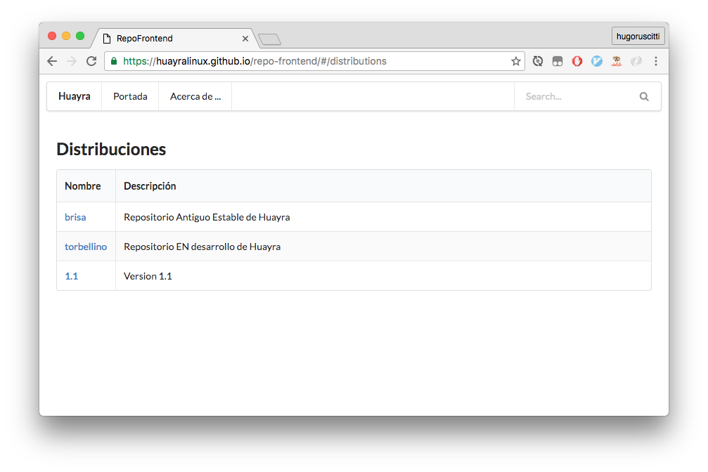

# Repo-frontend

[](https://travis-ci.org/HuayraLinux/repo-frontend)

Una aplicación web que nos permite visualizar el estado del repositorio,
las versiones de los paquetes y hacer consultas.




## Versión online

Actualmente estamos publicando una versión de produccion en: <a href="http://repo-frontend.surge.sh" target=_blank>http://repo-frontend.surge.sh</a>

## Como instalar

Este proyecto se realizó usando ember-js, así que los pasos de instalación
y prueba local son:

```
npm install
bower install
ember serve
```
